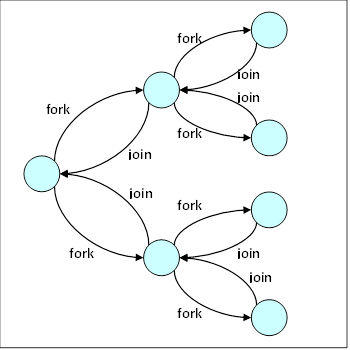

## Fork/Join

В параллельниых вычисления `Fork/Join Model` представляет собой способ
настройки и выполнения параллельных программ так, что выполнение
ветвится на подзадачи (branch off, `fork`) и все ветви выполняются в паралелли,
после этого результаты подзадач собираются вместе (merge, `join`) и возобновляется
последовательное выполнение программы. Параллельная секция может разбиваться на подзадачи
рекурсивно, пока не будет достигнут минимальный размер подзадач.





Псевдовод для данной модели может быть следующий:

```python
solve(problem):
    if problem is small enough:
        solve problem directly (sequential algorithm)
    else:
        for part in subdivide(problem)
            fork subtask to solve(part)
        join all subtasks spawned in previous loop
        return combined results
```

