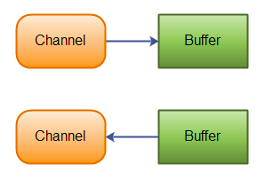
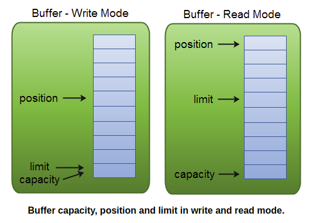
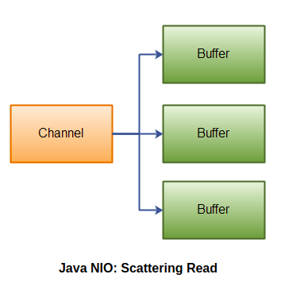
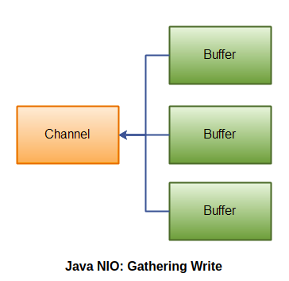
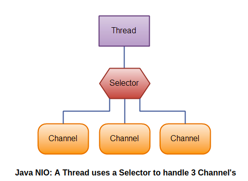

# NIO
NIO = New Input/Output

[источник](http://tutorials.jenkov.com/java-nio/overview.html)

## Overview

**Java NIO** состоит из следующих ключевых компонент:
* Channels
* Buffers
* Selectors

В **NIO** больше классов, но именно эти три являются наиболее важными.

## Channels and Buffers

**Channel**

Обычно все IO операции в **NIO** начинаются с `Channels`.

Есть несколько реализаций `Channels` в **NIO**:

* **FileChannel** - читать и записывать данные в файлы
* **DatagramChannel** - читать и записывать данные через сеть по протоколу **UDP**
* **SocketChannel** - читать и записывать данные через сеть по протоколу **TCP**
* **ServerSocketChannel** - позволяет слушать все входящие **TCP** соединения, как это делают сервера. Для каждого входящего соединения создается `SocketChannel`

То есть `Channels` поддерживают протоколы **UDP**, **TCP**, а также **File IO**

`Channels` читают данные из буфферов и записывают данные в буффер:



`Channels` похожи на `Stream` за некоторыми исключениями:
* можно писать и читать через `Channel`. `Steam` обычно только однонаправленные: либо только для чтения, либо только для записи
* `Channel` могут читать и писать асинхронно
* `Channel` проводят все операции через `Buffer`

**Buffer**

Есть некоторое количество реализаций `Buffer` в **Java NIO**:

* ByteBuffer
* CharBuffer
* DoubleBuffer
* FloatBuffer
* IntBuffer
* LongBuffer
* ShortBuffer

То есть буфферы работают со всеми примитивными типами.

**Пример**
использования каналов и буфферов для чтения/записи файлов.


```java
RandomAccessFile aFile = new RandomAccessFile("data/nio-data.txt", "rw");
FileChannel inChannel = aFile.getChannel();

ByteBuffer buf = ByteBuffer.allocate(48);

int bytesRead = inChannel.read(buf);
while (bytesRead != -1) {

  System.out.println("Read " + bytesRead);
  buf.flip();

  while(buf.hasRemaining()) {
      System.out.print((char) buf.get());
  }

  buf.clear();
  bytesRead = inChannel.read(buf);
}
aFile.close();
```

Функция `flip()` переключает буффер между режимами чтения-записи.

**Buffers. Продолжение**

Буффер - это по сути кусочек памяти, который выделяется при начале работы с буфферами 
и из которого можно читать/писать. Этот кусочек памяти обернут в **NIO Buffer Object**,
и уже эта обертка предоставляет множество методов, которые облегчают работу с данным кусочком памяти.

Типичный алгоритм использования буфферов состоит их 4-х шагов:
1. Записать данные в буффер - `writing mode`
2. Вызвать метод `buffer.filp()`
3. Прочитать данные из буффера - `reading mode`
4. Вызвать метод `buffer.clear()` или `buffer.compact()`

> `clear()` - удаляет все содержимое буффера
> `compact()` - удаляет содержимое, которое уже было прочитанно, а вся остальная информация,
которая до сих пор не была прочитана, сдвигается к началу буффера



#### Allocating a buffer

Создание буффера - аллоцирование памяти для него.
Создадим буффер, который сможет вмещать 48 байт.

```java
ByteBuffer buf = ByteBuffer.allocate(48);
```

## Scatter / Gather 

### Scatter
**Scattering read** читает данные из одно канала и записывает в несколько буфферов.

Иллюстрация данного процесса:


Пример кода:
```java
ByteBuffer header = ByteBuffer.allocate(128);
ByteBuffer body   = ByteBuffer.allocate(1024);

ByteBuffer[] bufferArray = { header, body };

channel.read(bufferArray);
```
Для чего это можно использовать?

Если ваши данные структурированны так, что, например, шапка документа имеет фиксированный размер,
то вы можете разделить работу с данными на работу с шапкой и работу с остальным документом.

### Gather

**Gathering write** записывает данные из нескольких буфферов в один канал.

Иллюстрация:


Пример кода:
```java
ByteBuffer header = ByteBuffer.allocate(128);
ByteBuffer body   = ByteBuffer.allocate(1024);

//write data into buffers

ByteBuffer[] bufferArray = { header, body };

channel.write(bufferArray);
```

## Selectors

Selector в **Java NIO** могут следить за один или множеством Channel и определять, какие из
этих каналов _готовы_ для чтения/записи.

Таким образом, один поток может управлять несколько каналами и, как следствие, несколькими соединениями по сети.

_Преимуществом_ использования селекторов является то, что все операции с каналами будут происходить в
одном потоке, поэтому не будет тратится время на накладные расходы, связанные, например, с созданием потока, 
переключение контекста и т.д.

  

#### Создание селектора

```java
Selector selector = Selector.open();
```

#### Регистрация каналов в селекторе

```java
channel.configureBlocking(false);

SelectionKey key = channel.register(selector, SelectionKey.OP_READ);
```
**NB:**
* каналы, зарегестрированные в селекторе, должны быть неблокирующими. По этой причине в Selector нельзя 
зарегестрировать FileChannel

* SocketChannel работают ок с селекторами

**register()**
Вторым параметром данной функции является так называемый "interest set". Через данный параметр можно явно указать, 
какое именно событие вас интересует слушать у Channel-а через Selector.

Какие бывают события-interest_set?

| Событие | корректное написание | Oracle документация | 
|---------|---------------------|---------------------|
| Connect | SelectionKey.OP_CONNECT | Suppose that a selection key's interest set contains OP_CONNECT at the start of a selection operation. If the selector detects that the corresponding socket channel is ready to complete its connection sequence, or has an error pending, then it will add OP_CONNECT to the key's ready set and add the key to its selected-key set. |
| Accept | SelectionKey.OP_ACCEPT | Suppose that a selection key's interest set contains OP_ACCEPT at the start of a selection operation. If the selector detects that the corresponding server-socket channel is ready to accept another connection, or has an error pending, then it will add OP_ACCEPT to the key's ready set and add the key to its selected-key set. |
| Read | SelectionKey.OP_READ | Suppose that a selection key's interest set contains OP_READ at the start of a selection operation. If the selector detects that the corresponding channel is ready for reading, has reached end-of-stream, has been remotely shut down for further reading, or has an error pending, then it will add OP_READ to the key's ready-operation set and add the key to its selected-key set. |
| Write | SelectionKey.OP_WRITE | Suppose that a selection key's interest set contains OP_WRITE at the start of a selection operation. If the selector detects that the corresponding channel is ready for writing, has been remotely shut down for further writing, or has an error pending, then it will add OP_WRITE to the key's ready set and add the key to its selected-key set. |

Можно указывать сразу несколько событий одновременно:
```java
int interestSet = SelectionKey.OP_READ | SelectionKey.OP_WRITE;
```

1. Можно проверить, что у `SelectionKey key` есть установленные флаги:
	```java
	int interestSet = selectionKey.interestOps();

	boolean isInterestedInAccept  = interestSet & SelectionKey.OP_ACCEPT;
	boolean isInterestedInConnect = interestSet & SelectionKey.OP_CONNECT;
	boolean isInterestedInRead    = interestSet & SelectionKey.OP_READ;
	boolean isInterestedInWrite   = interestSet & SelectionKey.OP_WRITE;    
	```
2. Можно узнать множество событий, к которым Channel готов:
	```java
	int readySet = selectionKey.readyOps();

	selectionKey.isAcceptable();
	selectionKey.isConnectable();
	selectionKey.isReadable();
	selectionKey.isWritable();
	```
